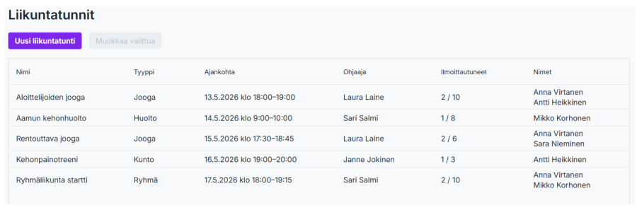
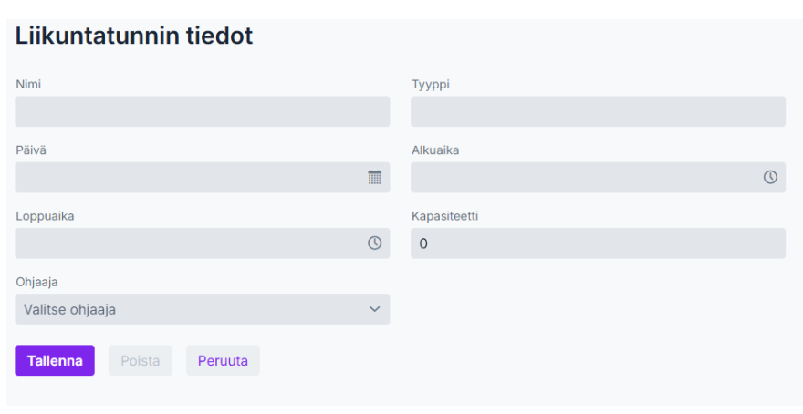
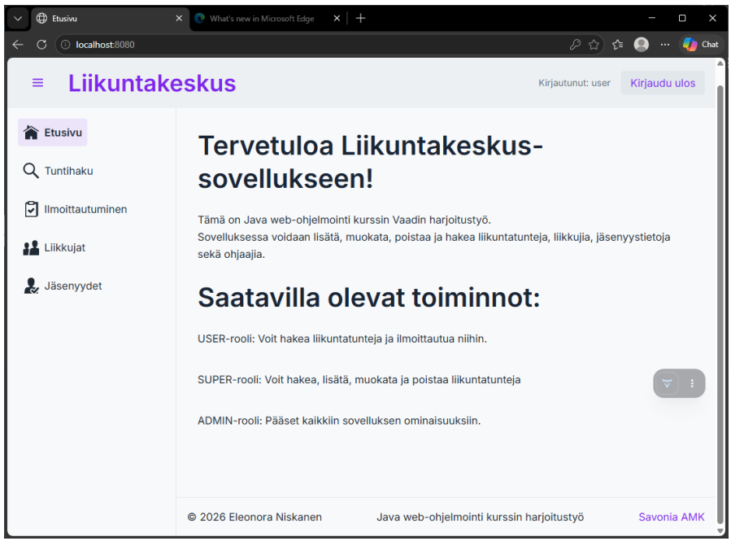

# Gym Management Application (Vaadin + Spring Boot)

This project is part of my software developer portfolio.

This application was developed as an assignment for the **Java Web Programming course at Savonia University of Applied Sciences**.  
It is a gym management system designed for managing customer data, memberships, fitness classes, and instructors.

---

## 🎯 Project Purpose

The goal of this project was to build a **full-stack web application** using:
- **Spring Boot** for the backend
- **Vaadin Flow** for the frontend

The project focuses on:
- Database modeling  
- CRUD operations  
- Authentication  
- UI design  

---

## 📸 Screenshots

### Class Listings  

Overview of available fitness classes   

### Add and Edit Classes

Form for creating and editing fitness classes  

### Application Overview  

Main application dashboard / homepage  


---

## ⚙️ Features

- CRUD operations for all entities  
- Authentication and login (Spring Security)  
- Role-based access control (USER, SUPER, ADMIN)  
- User registration  
- Dynamic search (Criteria API)  
- CSV import and export  
- File upload and storage  
- Localization (Finnish / English)  
- Vaadin Server Push  
- Integration of an external JavaScript component (Quill.js)  

---

## 🧰 Technologies

### Backend
- Java  
- Spring Boot  
- Spring Data JPA  
- Spring Security  

### Frontend
- Vaadin Flow  

### Database
- Hibernate / JPA  

### Other Tools
- Maven  
- Docker  

---

## ▶️ Running the Application

### Run locally (Maven)

```bash
mvn spring-boot:run
```

## Author
Eleonora Niskanen


## Documentation

A more detailed technical report (including full descriptions and all screenshots):

[📄 Open technical report (PDF)](Vaadin_harjoitustyoraportti_niskanen_eleonora.pdf)

